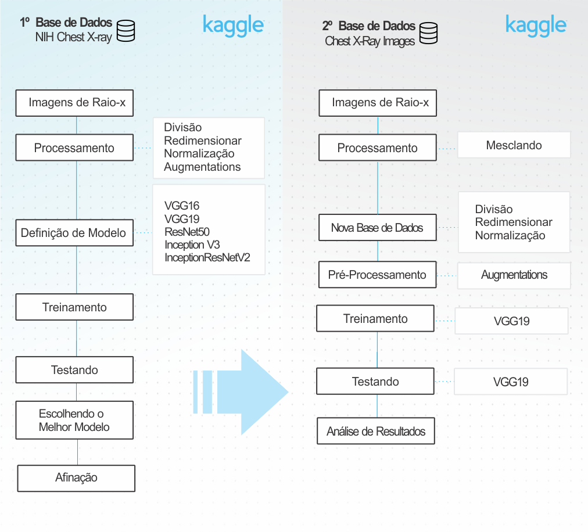

# TCC INTELIGÊNCIA ARTIFICIAL 2019S1 - PÓS GRADUAÇÃO FACENS

<h3>Detecção de Pneumonia por Imagens de Raio-x</h3>

<h2> Introdução </h2>

<h3> O que é Pneumonia? </h3>

 É a infecção do espaço intersticial pulmonar e/ou dos alvéolos. A infecção pode ser causada por diferentes microrganismos e outros agentes etiológicos tais como: 

<ul>
    <li>Mycoplasma;</li>
    <li>Chamidoplila vírus;</li>
    <li>Pneumococo haemophilus;</li>
    <li>Moraxella catarrhalis;</li>
    <li>reações alérgicas;</li>
    <li>produtos tóxicos.</li>
</ul>

 O quadro inflamatório gerado em resposta ao agente infeccioso configura a patologia: Pneumonia. 

<h3> Como é realizado o diagnóstico ?</h3>

O diagnóstico é embasado em uma tríade:
    
<ul>
    <li>Anamnese;</li>
    <li>Quadro clínico ou Sintomatologia; </li>
    <li>Exame de imagem.</li>
</ul>
    
<h4><b>Anamnese</b></h4>

A anamnese e exame físico fazem parte da etapa do Histórico de Enfermagem do Processo de Enfermagem. Sua implementação visa o cuidado individualizado, holístico, humanizado e com embasamento científico.

<h4><b>Quadro clínico ou Sintomatologia </b></h4>

 Representa um conjunto de sinais e sintomas presentes em uma determinada doença.

    
<h4><b>Exame de imagem</b></h4>

 São exames que visam a coleta de dados do interior do  corpo do paciente, utilizando-se de diferentes técnicas como campos magnéticos, ondas sonoras, câmeras e etc.

<i>Para detecção de Pneumonia, normalmente são utilizadas radiografias(raio-x).</i>
 

<h3> Por que utilizar técnicas de inteligência artificial nesse processo?</h3>

 A tecnologia como um todo, primeiramente entra para dar apóio as interpretações clínicas e contribui para evitar erros humanos, não substituindo mas auxiliando o médico no processo. 

 Ao avaliar padrões nas imagens, o sistema pode tentar detectar fases da doença, não perceptíveis a olho humano.
 

<h3>Proposta</h3>

 Obter um conjunto de imagens de raio-x do Torax e através da aplicação de tecnicas de aprendidas no curso, conseguir classificar as imagens em 2 grupos específicos. Utilizando das técnicas aprendidas no curso para utlizar em um problema do mundo real:

<ul>
    <li>Normal;   </li>
    <li>Pneumonia. </li>
</ul>  

<h3>Ferramentas e Bibliotecas </h3>

 

<h3>Arquitetura da Solução</h3>
 

 

